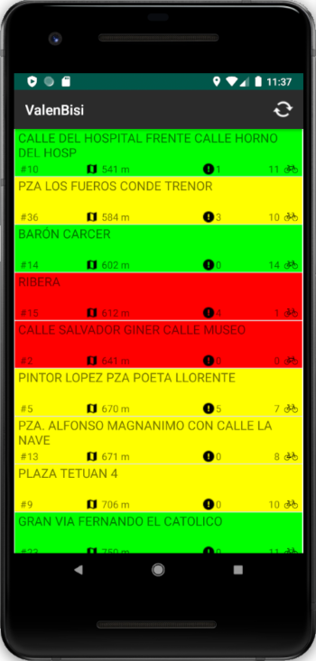
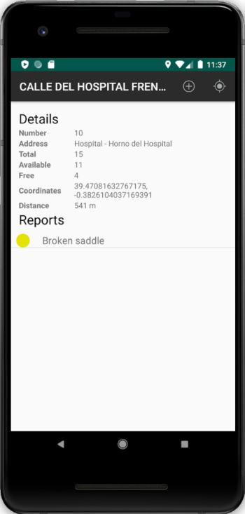
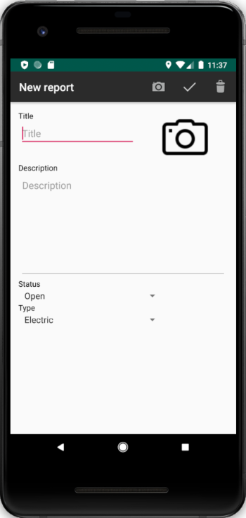
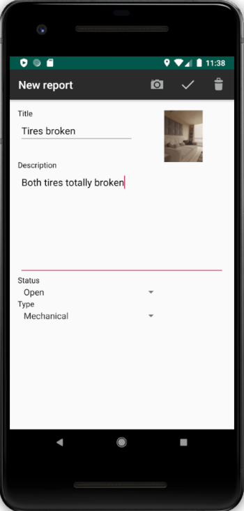
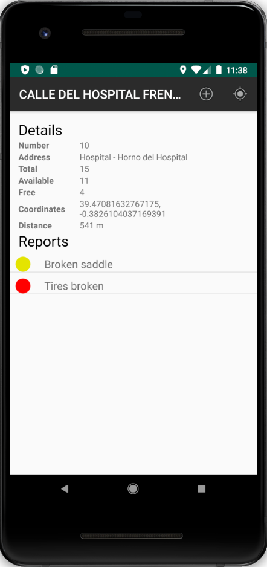
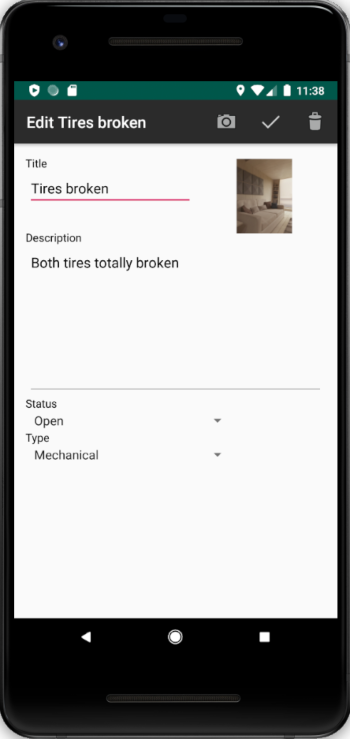
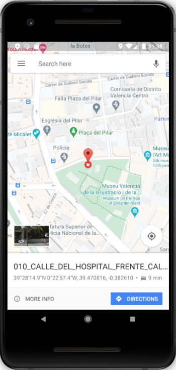

# ValenBisi
Android application for bicycle sharing system

## Table of contents
* [General info](#general-info)
* [Screenshots](#screenshots)
* [Technologies](#technologies)
* [Features](#features)
* [Additional information](#additional-information)
* [To-do list](to-do-list)

## General info
Project made for the subject Applications for Mobile Devices on Universitat de Valencia during my Erasmus+ exchange. I developed the application for Android devices. The application can be used for Valenbisi, the bike rental system of the City of Valencia. The app allows users to check the status of the different bike stations and to create incident reports. I used the services of the City Council of Valencia to retrieve data of Valenbisi bike stations. This query is carried out using a JSON file that can be requested from the web service of Valencia’s open data website to display real-time data to users. On the list of bike stations, the information about each of them is showed. I also created a local database that allows the creation of new incident reports associated with each of the bike station. This practice was developed using Android Studio.
The goals of the practice were the following:
* working with JSON format files
* working with Activities and Intents
* working with ListView and Adapter
* developing layouts to display the different elements of the user interface
* creating a local SQLite database
* managing databases, including select, insert, update and delete operations.
* working with HTTP services

## Screenshots

  
  

  
  

  
  

  

## Technologies
* Android 
* Java
* jcoord 1.0

## Features
* displaying list of bike stations sorted by distance with general information (number, distance, number of reports, number of available bikes)
* dividing stations into categories (colors) based on the number of bikes available
* displaying details about the chosen bike station (number, address, total number of bike spaces, number of available bikes, number of free bike spaces, coordinates of the stations, distance, list of reports)
* adding reports for bike stations (title, description, status, type, photo)
* editing added reports
* displaying location of the chosen bike station

## Additional information
The meaning of the color on the list of bike stations:
* green - more then 10 bikes available
* yellow - more than 4 and up to 10 bikes available ([5; 10])
* red - up to 4 bikes available ([0; 4])

The meaning of the color on the list of reports:
* red - status of the report: Open
* yellow - status of the report: Processing
* green - status of the report: Closed

## To-do list:
* remote database to share reports between users
